Books from your To-Read Shelf with at least 100 ratings, highest rated first.

|Title|Average Rating|Histogram|Number of Ratings|
|---|---|---|---|
|[Chasing the Scream: The First and Last Days of the War on Drugs](https://www.goodreads.com/book/show/22245552-chasing-the-scream)|4.48||3978|
|[The Visual Display of Quantitative Information](https://www.goodreads.com/book/show/17744.The_Visual_Display_of_Quantitative_Information)|4.41||5095|
|[The Slight Edge: Secret to a Successful Life](https://www.goodreads.com/book/show/590652.The_Slight_Edge)|4.4||7303|
|[The Giving Tree](https://www.goodreads.com/book/show/370493.The_Giving_Tree)|4.38||636162|
|[Kurt Vonnegut's Cat's Cradle](https://www.goodreads.com/book/show/4983.Kurt_Vonnegut_s_Cat_s_Cradle)|4.34||26221|
|[Ready Player One](https://www.goodreads.com/book/show/9969571-ready-player-one)|4.31||309149|
|[Surely You're Joking, Mr. Feynman!: Adventures of a Curious Character](https://www.goodreads.com/book/show/5544.Surely_You_re_Joking_Mr_Feynman_)|4.29||81603|
|[Mindstorms: Children, Computers, And Powerful Ideas](https://www.goodreads.com/book/show/703532.Mindstorms)|4.29|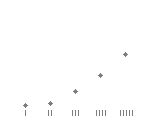|381|
|[Night (The Night Trilogy, #1)](https://www.goodreads.com/book/show/1617.Night)|4.28|.png)|619282|
|[To Kill a Mockingbird](https://www.goodreads.com/book/show/2657.To_Kill_a_Mockingbird)|4.24|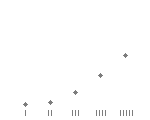|2975139|
|[Don't Make Me Think: A Common Sense Approach to Web Usability](https://www.goodreads.com/book/show/23941920-don-t-make-me-think)|4.23||12545|
|[Mindfulness in Plain English](https://www.goodreads.com/book/show/64369.Mindfulness_in_Plain_English)|4.23|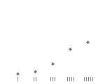|7157|
|[Cat's Cradle](https://www.goodreads.com/book/show/135479.Cat_s_Cradle)|4.18|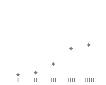|249951|
|[I, Robot (Robot, #0.1)](https://www.goodreads.com/book/show/41804.I_Robot)|4.16|.png)|186701|
|[The Design of Everyday Things](https://www.goodreads.com/book/show/840.The_Design_of_Everyday_Things)|4.16|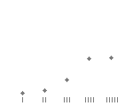|12129|
|[1984](https://www.goodreads.com/book/show/5470.1984)|4.12||1835659|
|[Inspired: How To Create Products Customers Love](https://www.goodreads.com/book/show/3323374-inspired)|4.12||2816|
|[The Selfish Gene](https://www.goodreads.com/book/show/61535.The_Selfish_Gene)|4.11|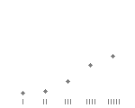|87385|
|[Abundance: The Future Is Better Than You Think](https://www.goodreads.com/book/show/13187824-abundance)|4.1|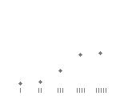|5479|
|[Top 10, Vol. 1](https://www.goodreads.com/book/show/598638.Top_10_Vol_1)|4.1|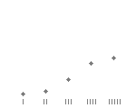|8052|
|[The Blank Slate: The Modern Denial of Human Nature](https://www.goodreads.com/book/show/5752.The_Blank_Slate)|4.05|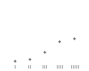|14833|
|[Missoula: Rape and the Justice System in a College Town](https://www.goodreads.com/book/show/24911006-missoula)|4.04|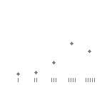|21240|
|[Slaughterhouse-Five](https://www.goodreads.com/book/show/4981.Slaughterhouse_Five)|4.04||809206|
|[Snow Crash](https://www.goodreads.com/book/show/830.Snow_Crash)|4.01|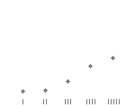|170288|
|[Logicomix: An epic search for truth](https://www.goodreads.com/book/show/6493321-logicomix)|3.99||10713|
|[A Clockwork Orange](https://www.goodreads.com/book/show/227463.A_Clockwork_Orange)|3.97|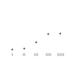|421561|
|[The Humane Interface: New Directions for Designing Interactive Systems](https://www.goodreads.com/book/show/344726.The_Humane_Interface)|3.97||697|
|[Catch-22](https://www.goodreads.com/book/show/168668.Catch_22)|3.97||525143|
|[Ringworld (Ringworld #1)](https://www.goodreads.com/book/show/61179.Ringworld)|3.96|.png)|74103|
|[The God Delusion](https://www.goodreads.com/book/show/14743.The_God_Delusion)|3.89||156282|
|[The Tipping Point: How Little Things Can Make a Big Difference](https://www.goodreads.com/book/show/2612.The_Tipping_Point)|3.89|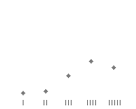|433107|
|[The Great Gatsby](https://www.goodreads.com/book/show/4671.The_Great_Gatsby)|3.87||2517125|
|[Animal Farm](https://www.goodreads.com/book/show/7613.Animal_Farm)|3.84||1799991|
|[Red Mars (Mars Trilogy, #1)](https://www.goodreads.com/book/show/77507.Red_Mars)|3.83|.png)|43737|
|[The Shallows: What the Internet is Doing to Our Brains](https://www.goodreads.com/book/show/6966823-the-shallows)|3.83|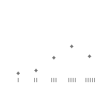|12839|
|[Invisible Man](https://www.goodreads.com/book/show/16981.Invisible_Man)|3.82||116561|
|[Stumbling on Happiness](https://www.goodreads.com/book/show/56627.Stumbling_on_Happiness)|3.8|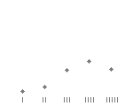|32121|
|[The Adventures of Huck Finn](https://www.goodreads.com/book/show/2947.The_Adventures_of_Huck_Finn)|3.79|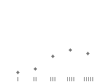|932105|
|[Sphere](https://www.goodreads.com/book/show/455373.Sphere)|3.75||123138|
|[Three Cups of Tea: One Man's Mission to Promote Peace ... One School at a Time](https://www.goodreads.com/book/show/49436.Three_Cups_of_Tea)|3.63|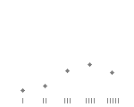|269512|
|[The Accidental Billionaires: The Founding of Facebook](https://www.goodreads.com/book/show/9181564-the-accidental-billionaires)|3.49|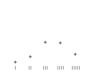|11054|
