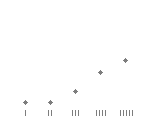

Books from your To-Read Shelf with at least 100 ratings, highest rated first.

|Title|Average Rating|Histogram|Number of Ratings|
|---|---|---|---|
|[The Feynman Lectures on Physics](https://www.goodreads.com/book/show/5546.The_Feynman_Lectures_on_Physics)|4.58||5387|
|[Elements of the Real in Man (Diamond Heart, #1)](https://www.goodreads.com/book/show/144256.Elements_of_the_Real_in_Man)|4.45|.png)|141|
|[Resistance Behind Bars: The Struggles of Incarcerated Women](https://www.goodreads.com/book/show/13592684-resistance-behind-bars)|4.44||109|
|[Vehicles: Experiments in Synthetic Psychology](https://www.goodreads.com/book/show/483485.Vehicles)|4.44||202|
|[The Art of Computer Programming, Volume 2: Seminumerical Algorithms](https://www.goodreads.com/book/show/112246.The_Art_of_Computer_Programming_Volume_2)|4.41||343|
|[Beyond Bigger Leaner Stronger: The Advanced Guide to Building Muscle, Staying Lean, and Getting Strong](https://www.goodreads.com/book/show/22924224-beyond-bigger-leaner-stronger)|4.39||187|
|[The Fire Next Time](https://www.goodreads.com/book/show/464260.The_Fire_Next_Time)|4.39||15248|
|[Between the World and Me](https://www.goodreads.com/book/show/25489625-between-the-world-and-me)|4.39||60929|
|[The Martian](https://www.goodreads.com/book/show/18007564-the-martian)|4.39||419036|
|[Computer Power and Human Reason: From Judgment to Calculation](https://www.goodreads.com/book/show/986428.Computer_Power_and_Human_Reason)|4.38||111|
|[A Pattern Language: Towns, Buildings, Construction](https://www.goodreads.com/book/show/79766.A_Pattern_Language)|4.38||2954|
|[Fear No Evil](https://www.goodreads.com/book/show/187806.Fear_No_Evil)|4.38||240|
|[True Hallucinations/The Archaic Revival](https://www.goodreads.com/book/show/114869.True_Hallucinations_The_Archaic_Revival)|4.37||119|
|[Code: The Hidden Language of Computer Hardware and Software](https://www.goodreads.com/book/show/44882.Code)|4.36||3093|
|[Captive Genders: Trans Embodiment and the Prison Industrial Complex](https://www.goodreads.com/book/show/9954047-captive-genders)|4.36||306|
|[The Art of Computer Programming: Volume 3: Sorting and Searching](https://www.goodreads.com/book/show/363999.The_Art_of_Computer_Programming)|4.35||357|
|[The Book Thief](https://www.goodreads.com/book/show/19063.The_Book_Thief)|4.35||1099705|
|[Cosmos](https://www.goodreads.com/book/show/55030.Cosmos)|4.35||68422|
|[Pihkal: A Chemical Love Story](https://www.goodreads.com/book/show/886113.Pihkal)|4.34||1494|
|[Maus I: A Survivor's Tale: My Father Bleeds History (Maus, #1)](https://www.goodreads.com/book/show/15196.Maus_I)|4.34|.png)|170115|
|[Automate the Boring Stuff with Python: Practical Programming for Total Beginners](https://www.goodreads.com/book/show/22514127-automate-the-boring-stuff-with-python)|4.34||220|
|[Our Bodies, Ourselves for the New Century](https://www.goodreads.com/book/show/97869.Our_Bodies_Ourselves_for_the_New_Century)|4.33||6331|
|[Clean Code: A Handbook of Agile Software Craftsmanship](https://www.goodreads.com/book/show/3735293-clean-code)|4.33||6227|
|[East of Eden](https://www.goodreads.com/book/show/4406.East_of_Eden)|4.33||309643|
|[The Stand](https://www.goodreads.com/book/show/149267.The_Stand)|4.33||424087|
|[Grey is the Color of Hope](https://www.goodreads.com/book/show/694516.Grey_is_the_Color_of_Hope)|4.32||250|
|[Feminist Theory: From Margin to Center](https://www.goodreads.com/book/show/51378.Feminist_Theory)|4.32||4327|
|[Man's Search for Meaning](https://www.goodreads.com/book/show/4069.Man_s_Search_for_Meaning)|4.32||152006|
|[Extreme Ownership: How U.S. Navy SEALs Lead and Win](https://www.goodreads.com/book/show/23848190-extreme-ownership)|4.31||1871|
|[Drugs Without the Hot Air: Minimizing the Harms of Legal and Illegal Drugs](https://www.goodreads.com/book/show/13592853-drugs-without-the-hot-air)|4.31||558|
|[Pale Blue Dot: A Vision of the Human Future in Space](https://www.goodreads.com/book/show/61663.Pale_Blue_Dot)|4.31||18150|
|[The Muqaddimah: An Introduction to History (Bollingen Series)](https://www.goodreads.com/book/show/229567.The_Muqaddimah)|4.3|.png)|2468|
|[The Autobiography of Martin Luther King, Jr.](https://www.goodreads.com/book/show/42547.The_Autobiography_of_Martin_Luther_King_Jr_)|4.3||10609|
|[Concrete Mathematics: A Foundation for Computer Science](https://www.goodreads.com/book/show/112243.Concrete_Mathematics)|4.3||1230|
|[Nonviolent Communication: A Language of Life](https://www.goodreads.com/book/show/71730.Nonviolent_Communication)|4.29||5842|
|[Ender's Game (The Ender Quintet, #1)](https://www.goodreads.com/book/show/375802.Ender_s_Game)|4.29|.png)|786947|
|[Visual Explanations: Images and Quantities, Evidence and Narrative](https://www.goodreads.com/book/show/17746.Visual_Explanations)|4.29||2148|
|[Gödel, Escher, Bach: An Eternal Golden Braid](https://www.goodreads.com/book/show/24113.G_del_Escher_Bach)|4.29||30618|
|[Failing Forward: How to Make the Most of Your Mistakes](https://www.goodreads.com/book/show/628070.Failing_Forward)|4.29||4502|
|[The Autobiography of Malcolm X](https://www.goodreads.com/book/show/92057.The_Autobiography_of_Malcolm_X)|4.28||106362|
|[What Do You Care What Other People Think?](https://www.goodreads.com/book/show/5548.What_Do_You_Care_What_Other_People_Think_)|4.28||14678|
|[Redefining Realness: My Path to Womanhood, Identity, Love & So Much More](https://www.goodreads.com/book/show/18144031-redefining-realness)|4.28||4542|
|[The Little Schemer](https://www.goodreads.com/book/show/548914.The_Little_Schemer)|4.28||1332|
|[Introduction to Algorithms](https://www.goodreads.com/book/show/108986.Introduction_to_Algorithms)|4.28||5097|
|[Devil in the Grove: Thurgood Marshall, the Groveland Boys, and the Dawn of a New America](https://www.goodreads.com/book/show/13425592-devil-in-the-grove)|4.28||5909|
|[The Little Prince](https://www.goodreads.com/book/show/157993.The_Little_Prince)|4.27||706677|
|[Born to Run: A Hidden Tribe, Superathletes, and the Greatest Race the World Has Never Seen](https://www.goodreads.com/book/show/6289283-born-to-run)|4.27||106915|
|[The Character of Physical Law](https://www.goodreads.com/book/show/291920.The_Character_of_Physical_Law)|4.27||3716|
|[The Demon-Haunted World: Science as a Candle in the Dark](https://www.goodreads.com/book/show/17349.The_Demon_Haunted_World)|4.27||39549|
|[The Essays of Ralph Waldo Emerson](https://www.goodreads.com/book/show/139005.The_Essays_of_Ralph_Waldo_Emerson)|4.27||1565|
|[The Miracle of Mindfulness: An Introduction to the Practice of Meditation](https://www.goodreads.com/book/show/95747.The_Miracle_of_Mindfulness)|4.27||12339|
|[The Clean Coder: A Code of Conduct for Professional Programmers](https://www.goodreads.com/book/show/10284614-the-clean-coder)|4.27||2531|
|[Pedagogy of the Oppressed](https://www.goodreads.com/book/show/72657.Pedagogy_of_the_Oppressed)|4.26||14027|
|[When the Body Says No: The Cost of Hidden Stress](https://www.goodreads.com/book/show/450534.When_the_Body_Says_No)|4.26||1180|
|[Love & Respect in the Family: The Transforming Power of Love and Respect Between Parent and Child](https://www.goodreads.com/book/show/17657147-love-respect-in-the-family)|4.26||190|
|[The Effective Engineer: How to Leverage Your Efforts In Software Engineering to Make a Disproportionate and Meaningful Impact](https://www.goodreads.com/book/show/25238425-the-effective-engineer)|4.26||200|
|[The Intelligent Investor](https://www.goodreads.com/book/show/106835.The_Intelligent_Investor)|4.26||22628|
|[Far from the Tree: Parents, Children, and the Search for Identity](https://www.goodreads.com/book/show/13547504-far-from-the-tree)|4.25||11735|
|[Good Omens: The Nice and Accurate Prophecies of Agnes Nutter, Witch](https://www.goodreads.com/book/show/12067.Good_Omens)|4.25||287642|
|[The Pleasure of Finding Things Out: The Best Short Works of Richard P. Feynman](https://www.goodreads.com/book/show/10260.The_Pleasure_of_Finding_Things_Out)|4.25||7077|
|[Mastery](https://www.goodreads.com/book/show/13589182-mastery)|4.25||10651|
|[V for Vendetta](https://www.goodreads.com/book/show/5805.V_for_Vendetta)|4.25||208147|
|[The Road to Eleusis: Unveiling the Secret of the Mysteries](https://www.goodreads.com/book/show/2402353.The_Road_to_Eleusis)|4.25||116|
|[The Player of Games (Culture, #2)](https://www.goodreads.com/book/show/18630.The_Player_of_Games)|4.25|.png)|38345|
|[The Interpersonal World Of The Infant: A View from Psychoanalysis and Developmental Psychology](https://www.goodreads.com/book/show/376433.The_Interpersonal_World_Of_The_Infant)|4.25||113|
|[The Kite Runner](https://www.goodreads.com/book/show/77203.The_Kite_Runner)|4.24||1686179|
|[Cryptonomicon](https://www.goodreads.com/book/show/816.Cryptonomicon)|4.24||74043|
|[Hold On to Your Kids: Why Parents Need to Matter More Than Peers](https://www.goodreads.com/book/show/106744.Hold_On_to_Your_Kids)|4.24||1934|
|[Acid Test: LSD, Ecstasy, and the Power to Heal](https://www.goodreads.com/book/show/23398678-acid-test)|4.24||339|
|[Making Thinking Visible](https://www.goodreads.com/book/show/10999036-making-thinking-visible)|4.24||717|
|[The Hobbit](https://www.goodreads.com/book/show/5907.The_Hobbit)|4.23||1985281|
|[Dont Make Me Think And Html World Wide Web](https://www.goodreads.com/book/show/1210562.Dont_Make_Me_Think_And_Html_World_Wide_Web)|4.23||12545|
|[The Collected Stories of Philip K. Dick 1: The Short Happy Life of the Brown Oxford](https://www.goodreads.com/book/show/22592.The_Collected_Stories_of_Philip_K_Dick_1)|4.23||3984|
|[The Mastery of Love: A Practical Guide to the Art of Relationship --Toltec Wisdom Book](https://www.goodreads.com/book/show/81939.The_Mastery_of_Love)|4.23||22758|
|[Envisioning Information](https://www.goodreads.com/book/show/17745.Envisioning_Information)|4.23||5192|
|[A Secure Base: Parent-Child Attachment and Healthy Human Development](https://www.goodreads.com/book/show/690495.A_Secure_Base)|4.23||310|
|[Queer (In)Justice: The Criminalization of LGBT People in the United States](https://www.goodreads.com/book/show/8462352-queer-in-justice)|4.23|Justice: The Criminalization of LGBT People in the United States.png)|330|
|[The Child With Special Needs: Encouraging Intellectual and Emotional Growth](https://www.goodreads.com/book/show/188263.The_Child_With_Special_Needs)|4.23||201|
|[Programming Pearls](https://www.goodreads.com/book/show/52084.Programming_Pearls)|4.22||2095|
|[Old Man's War (Old Man's War, #1)](https://www.goodreads.com/book/show/51964.Old_Man_s_War)|4.22|.png)|93104|
|[The Shock Doctrine: The Rise of Disaster Capitalism](https://www.goodreads.com/book/show/1237300.The_Shock_Doctrine)|4.22||24107|
|[Children: The Challenge](https://www.goodreads.com/book/show/243095.Children)|4.22||500|
|[Elon Musk: Inventing the Future](https://www.goodreads.com/book/show/22543496-elon-musk)|4.21||38572|
|[The Secret of Childhood](https://www.goodreads.com/book/show/920412.The_Secret_of_Childhood)|4.21||543|
|[The Lightning Thief (Percy Jackson and the Olympians, #1)](https://www.goodreads.com/book/show/28187.The_Lightning_Thief)|4.21|.png)|1225671|
|[The Inner Game of Tennis: The Classic Guide to the Mental Side of Peak Performance](https://www.goodreads.com/book/show/905.The_Inner_Game_of_Tennis)|4.21||3308|
|[Process and Reality](https://www.goodreads.com/book/show/851541.Process_and_Reality)|4.21||434|
|[The Souls of Black Folk](https://www.goodreads.com/book/show/318742.The_Souls_of_Black_Folk)|4.21||20204|
|[Make It Stick: The Science of Successful Learning](https://www.goodreads.com/book/show/18770267-make-it-stick)|4.21||2773|
|[Stephen King's N.](https://www.goodreads.com/book/show/7006562-stephen-king-s-n)|4.21||10297|
|[The Five Love Languages: How to Express Heartfelt Commitment to Your Mate](https://www.goodreads.com/book/show/567795.The_Five_Love_Languages)|4.21||166234|
|[Manufacturing Consent: The Political Economy of the Mass Media](https://www.goodreads.com/book/show/12617.Manufacturing_Consent)|4.21||9978|
|[The Brain That Changes Itself: Stories of Personal Triumph from the Frontiers of Brain Science](https://www.goodreads.com/book/show/570172.The_Brain_That_Changes_Itself)|4.2||19453|
|[Theory of Games and Economic Behavior](https://www.goodreads.com/book/show/483055.Theory_of_Games_and_Economic_Behavior)|4.2||141|
|[Daniels' Running Formula](https://www.goodreads.com/book/show/112152.Daniels_Running_Formula)|4.2||1770|
|[The Hitchhiker's Guide to the Galaxy (Hitchhiker's Guide to the Galaxy, #1)](https://www.goodreads.com/book/show/11.The_Hitchhiker_s_Guide_to_the_Galaxy)|4.2|.png)|938513|
|[Revolution in The Valley: The Insanely Great Story of How the Mac Was Made](https://www.goodreads.com/book/show/40492.Revolution_in_The_Valley)|4.2||1124|
|[Free to Choose: A Personal Statement](https://www.goodreads.com/book/show/97820.Free_to_Choose)|4.2||4597|
|[Invisible Cities](https://www.goodreads.com/book/show/9809.Invisible_Cities)|4.2||33334|
|[Refactoring: Improving the Design of Existing Code](https://www.goodreads.com/book/show/44936.Refactoring)|4.2||4345|
|[True Hallucinations](https://www.goodreads.com/book/show/114867.True_Hallucinations)|4.2||1308|
|[The Moral Case for Fossil Fuels](https://www.goodreads.com/book/show/20821049-the-moral-case-for-fossil-fuels)|4.2||481|
|[The Elements of Style](https://www.goodreads.com/book/show/33514.The_Elements_of_Style)|4.19||53113|
|[Mother Night](https://www.goodreads.com/book/show/9592.Mother_Night)|4.19||48921|
|[The Ascent of Man](https://www.goodreads.com/book/show/461104.The_Ascent_of_Man)|4.18||4412|
|[Anathem](https://www.goodreads.com/book/show/2845024-anathem)|4.18||44668|
|[A Short History of Nearly Everything](https://www.goodreads.com/book/show/21.A_Short_History_of_Nearly_Everything)|4.18||185669|
|[An Anthropologist on Mars: Seven Paradoxical Tales](https://www.goodreads.com/book/show/64666.An_Anthropologist_on_Mars)|4.18||11447|
|[Teaching as a Subversive Activity](https://www.goodreads.com/book/show/79681.Teaching_as_a_Subversive_Activity)|4.18||799|
|[Racism without Racists: Color-Blind Racism and the Persistence of Racial Inequality in the United States](https://www.goodreads.com/book/show/433281.Racism_without_Racists)|4.18||1235|
|[Eichmann in Jerusalem: A Report on the Banality of Evil](https://www.goodreads.com/book/show/52090.Eichmann_in_Jerusalem)|4.18||7348|
|[A Fighting Chance](https://www.goodreads.com/book/show/18779662-a-fighting-chance)|4.18||7096|
|[Outsider in the White House](https://www.goodreads.com/book/show/25738983-outsider-in-the-white-house)|4.18||831|
|[The Better Angels of Our Nature: Why Violence Has Declined](https://www.goodreads.com/book/show/11107244-the-better-angels-of-our-nature)|4.18||10699|
|[Whipping Girl: A Transsexual Woman on Sexism and the Scapegoating of Femininity](https://www.goodreads.com/book/show/605663.Whipping_Girl)|4.18||3954|
|[Palace of Desire](https://www.goodreads.com/book/show/5495.Palace_of_Desire)|4.18||4648|
|[Outsider in the House](https://www.goodreads.com/book/show/176167.Outsider_in_the_House)|4.18||831|
|[Mastery: The Keys to Success and Long-Term Fulfillment](https://www.goodreads.com/book/show/81940.Mastery)|4.17||2886|
|[Dumbing Us Down: The Hidden Curriculum of Compulsory Education](https://www.goodreads.com/book/show/225850.Dumbing_Us_Down)|4.17||4328|
|[Smalltalk Best Practice Patterns](https://www.goodreads.com/book/show/781561.Smalltalk_Best_Practice_Patterns)|4.17||173|
|[Designing for the Digital Age: How to Create Human-Centered Products and Services](https://www.goodreads.com/book/show/3880458-designing-for-the-digital-age)|4.17||342|
|[Weapons of Mass Instruction: A Schoolteacher's Journey through the Dark World of Compulsory Schooling](https://www.goodreads.com/book/show/3429724-weapons-of-mass-instruction)|4.17||1018|
|[The Hard Thing About Hard Things: Building a Business When There Are No Easy Answers](https://www.goodreads.com/book/show/18176747-the-hard-thing-about-hard-things)|4.17||15251|
|[Food of the Gods: The Search for the Original Tree of Knowledge](https://www.goodreads.com/book/show/51660.Food_of_the_Gods)|4.17||4797|
|[The Moon is a Harsh Mistress](https://www.goodreads.com/book/show/16690.The_Moon_is_a_Harsh_Mistress)|4.17||77964|
|[Punishing the Poor: The Neoliberal Government of Social Insecurity](https://www.goodreads.com/book/show/6504869-punishing-the-poor)|4.17||134|
|[Dune (Dune Chronicles, #1)](https://www.goodreads.com/book/show/53732.Dune)|4.17|.png)|473019|
|[The Science of Interstellar](https://www.goodreads.com/book/show/23261448-the-science-of-interstellar)|4.17||2149|
|[What If?: Serious Scientific Answers to Absurd Hypothetical Questions](https://www.goodreads.com/book/show/21413662-what-if)|4.16||51400|
|[The 48 Laws of Power](https://www.goodreads.com/book/show/1303.The_48_Laws_of_Power)|4.16||31619|
|[How to Solve It: A New Aspect of Mathematical Method](https://www.goodreads.com/book/show/192221.How_to_Solve_It)|4.16||2470|
|[Parallel Worlds: A Journey Through Creation, Higher Dimensions, and the Future of the Cosmos](https://www.goodreads.com/book/show/33418.Parallel_Worlds)|4.16||11884|
|[The Greatest Show on Earth: The Evidence for Evolution](https://www.goodreads.com/book/show/6117055-the-greatest-show-on-earth)|4.16||33126|
|[Delusions of Gender: How Our Minds, Society, and Neurosexism Create Difference](https://www.goodreads.com/book/show/8031168-delusions-of-gender)|4.16||4376|
|[Dragons of Eden: Speculations on the Evolution of Human Intelligence](https://www.goodreads.com/book/show/32276.Dragons_of_Eden)|4.16||12728|
|[The Inevitable: Understanding the 12 Technological Forces That Will Shape Our Future](https://www.goodreads.com/book/show/27209431-the-inevitable)|4.15||734|
|[Genius: The Life and Science of Richard Feynman](https://www.goodreads.com/book/show/98685.Genius)|4.15||13676|
|[Why Evolution Is True](https://www.goodreads.com/book/show/4005310-why-evolution-is-true)|4.15||13319|
|[The Sirens of Titan](https://www.goodreads.com/book/show/4982.The_Sirens_of_Titan)|4.15||74248|
|[Bigger Leaner Stronger: The Simple Science of Building the Ultimate Male Body](https://www.goodreads.com/book/show/25049103-bigger-leaner-stronger)|4.15||1923|
|[Unlocking the Clubhouse: Women in Computing](https://www.goodreads.com/book/show/176395.Unlocking_the_Clubhouse)|4.15||186|
|[Working Effectively with Legacy Code](https://www.goodreads.com/book/show/44919.Working_Effectively_with_Legacy_Code)|4.15||2072|
|[The Archaic Revival](https://www.goodreads.com/book/show/351037.The_Archaic_Revival)|4.15||1552|
|[The Shining (The Shining, #1)](https://www.goodreads.com/book/show/11588.The_Shining)|4.15|.png)|741189|
|[Think and Grow Rich](https://www.goodreads.com/book/show/1005.Think_and_Grow_Rich)|4.15||96518|
|[Drug Crazy: How We Got into This Mess and How We Can Get Out](https://www.goodreads.com/book/show/378906.Drug_Crazy)|4.15||166|
|[Burning Down the House: The End of Juvenile Prison](https://www.goodreads.com/book/show/18406423-burning-down-the-house)|4.15||190|
|[Creative Schools: The Grassroots Revolution That's Transforming Education](https://www.goodreads.com/book/show/23398899-creative-schools)|4.14||731|
|[Swann's Way (In Search of Lost Time, #1)](https://www.goodreads.com/book/show/12749.Swann_s_Way)|4.14|.png)|27596|
|[No god but God: The Origins, Evolution and Future of Islam](https://www.goodreads.com/book/show/25307.No_god_but_God)|4.14||14162|
|[Good Strategy Bad Strategy: The Difference and Why It Matters](https://www.goodreads.com/book/show/11721966-good-strategy-bad-strategy)|4.14||2400|
|[The Stars My Destination](https://www.goodreads.com/book/show/333867.The_Stars_My_Destination)|4.14||29843|
|[Self-Reliance and Other Essays](https://www.goodreads.com/book/show/123845.Self_Reliance_and_Other_Essays)|4.14||13435|
|[Design Patterns: Elements of Reusable Object-Oriented Software](https://www.goodreads.com/book/show/85009.Design_Patterns)|4.14||6571|
|[The Forever War (The Forever War, #1)](https://www.goodreads.com/book/show/21611.The_Forever_War)|4.14|.png)|90325|
|[Undeniable: Evolution and the Science of Creation](https://www.goodreads.com/book/show/23848261-undeniable)|4.14||6576|
|[Meggs' History of Graphic Design](https://www.goodreads.com/book/show/641593.Meggs_History_of_Graphic_Design)|4.14||1525|
|[The Happiness Advantage: The Seven Principles of Positive Psychology That Fuel Success and Performance at Work](https://www.goodreads.com/book/show/9484114-the-happiness-advantage)|4.13||10867|
|[Raising An Emotionally Intelligent Child](https://www.goodreads.com/book/show/213186.Raising_An_Emotionally_Intelligent_Child)|4.13||2238|
|[Linear Algebra and Its Applications](https://www.goodreads.com/book/show/179699.Linear_Algebra_and_Its_Applications)|4.13||498|
|[Welcome to the Monkey House](https://www.goodreads.com/book/show/4985.Welcome_to_the_Monkey_House)|4.13||39389|
|[Merchants of Doubt: How a Handful of Scientists Obscured the Truth on Issues from Tobacco Smoke to Global Warming](https://www.goodreads.com/book/show/9498496-merchants-of-doubt)|4.13||2155|
|[The Absorbent Mind](https://www.goodreads.com/book/show/60511.The_Absorbent_Mind)|4.12||1204|
|[The Noonday Demon: An Atlas of Depression](https://www.goodreads.com/book/show/13932.The_Noonday_Demon)|4.12||7222|
|[Beautiful Evidence](https://www.goodreads.com/book/show/17743.Beautiful_Evidence)|4.12||1634|
|[Islam and the Future of Tolerance: A Dialogue](https://www.goodreads.com/book/show/25151238-islam-and-the-future-of-tolerance)|4.12||2688|
|[Amusing Ourselves to Death: Public Discourse in the Age of Show Business](https://www.goodreads.com/book/show/74034.Amusing_Ourselves_to_Death)|4.12||9439|
|[Palace Walk](https://www.goodreads.com/book/show/762134.Palace_Walk)|4.12||9202|
|[The Things They Carried](https://www.goodreads.com/book/show/133518.The_Things_They_Carried)|4.12||154734|
|[Way of the Peaceful Warrior: A Book That Changes Lives](https://www.goodreads.com/book/show/2255.Way_of_the_Peaceful_Warrior)|4.12||33461|
|[You Must Change Your Life](https://www.goodreads.com/book/show/15931668-you-must-change-your-life)|4.12||185|
|[An Astronaut's Guide to Life on Earth](https://www.goodreads.com/book/show/18170143-an-astronaut-s-guide-to-life-on-earth)|4.12||24308|
|[When Affirmative Action Was White: An Untold History of Racial Inequality in Twentieth-Century America](https://www.goodreads.com/book/show/88367.When_Affirmative_Action_Was_White)|4.11||507|
|[Fat! So?: Because You Don't Have to Apologize for Your Size](https://www.goodreads.com/book/show/197923.Fat_So_)|4.11||876|
|[Artificial Intelligence: A Modern Approach](https://www.goodreads.com/book/show/27543.Artificial_Intelligence)|4.11||2431|
|[The Tell-Tale Brain: A Neuroscientist's Quest for What Makes Us Human](https://www.goodreads.com/book/show/11539535-the-tell-tale-brain)|4.11||6557|
|[Freud: A Life for Our Time](https://www.goodreads.com/book/show/97746.Freud)|4.11||868|
|[The Psychology of Computer Programming](https://www.goodreads.com/book/show/1660754.The_Psychology_of_Computer_Programming)|4.11||316|
|[Designing for People](https://www.goodreads.com/book/show/1604762.Designing_for_People)|4.11||124|
|[The Geek Feminist Revolution](https://www.goodreads.com/book/show/26792189-the-geek-feminist-revolution)|4.11||606|
|[Nine Princes in Amber (The Chronicles of Amber #1)](https://www.goodreads.com/book/show/92121.Nine_Princes_in_Amber)|4.11|.png)|35915|
|[Black Like Me](https://www.goodreads.com/book/show/42603.Black_Like_Me)|4.11||45748|
|[Deschooling Society](https://www.goodreads.com/book/show/223403.Deschooling_Society)|4.11||1373|
|[Into Thin Air: A Personal Account of the Mount Everest Disaster](https://www.goodreads.com/book/show/1898.Into_Thin_Air)|4.1||283740|
|[The Willpower Instinct: How Self-Control Works, Why It Matters, and What You Can Do to Get More of It](https://www.goodreads.com/book/show/10865206-the-willpower-instinct)|4.1||13065|
|[Hyperspace](https://www.goodreads.com/book/show/33426.Hyperspace)|4.1||13334|
|[Beyond Measure: Rescuing an Overscheduled, Overtested, Underestimated Generation](https://www.goodreads.com/book/show/25111133-beyond-measure)|4.1||104|
|[Altered Carbon (Takeshi Kovacs, #1)](https://www.goodreads.com/book/show/40445.Altered_Carbon)|4.1|.png)|41226|
|[A Brief History of Time](https://www.goodreads.com/book/show/3869.A_Brief_History_of_Time)|4.1||160409|
|[The Wisdom of Whores: Bureaucrats, Brothels, and the Business of AIDS](https://www.goodreads.com/book/show/2602190-the-wisdom-of-whores)|4.1||1960|
|[The Righteous Mind: Why Good People are Divided by Politics and Religion](https://www.goodreads.com/book/show/11324722-the-righteous-mind)|4.1||10912|
|[The Happiness Hypothesis: Finding Modern Truth in Ancient Wisdom](https://www.goodreads.com/book/show/96884.The_Happiness_Hypothesis)|4.1||12106|
|[Understanding Media: The Extensions of Man](https://www.goodreads.com/book/show/126274.Understanding_Media)|4.1||2218|
|[On Becoming a Person: A Therapist's View of Psychotherapy](https://www.goodreads.com/book/show/174879.On_Becoming_a_Person)|4.1||9237|
|[The Fabric of the Cosmos: Space, Time, and the Texture of Reality](https://www.goodreads.com/book/show/22435.The_Fabric_of_the_Cosmos)|4.1||23176|
|[Foundation (Foundation, #1)](https://www.goodreads.com/book/show/29579.Foundation)|4.1|.png)|264245|
|[The Mindful Brain: Reflection and Attunement in the Cultivation of Well-Being](https://www.goodreads.com/book/show/403026.The_Mindful_Brain)|4.1||681|
|[2001: A Space Odyssey (Space Odyssey, #1)](https://www.goodreads.com/book/show/70535.2001)|4.1|.png)|160688|
|[Cradle to Cradle: Remaking the Way We Make Things](https://www.goodreads.com/book/show/5571.Cradle_to_Cradle)|4.1||7347|
|[The Invisible Orientation: An Introduction to Asexuality](https://www.goodreads.com/book/show/20344514-the-invisible-orientation)|4.09||316|
|[The Girl with the Dragon Tattoo (Millennium, #1)](https://www.goodreads.com/book/show/2429135.The_Girl_with_the_Dragon_Tattoo)|4.09|.png)|1711600|
|[Outliers: The Story of Success](https://www.goodreads.com/book/show/3228917-outliers)|4.09||333989|
|[The Idea Factory: Bell Labs and the Great Age of American Innovation](https://www.goodreads.com/book/show/11797471-the-idea-factory)|4.09||2799|
|[Rocket Surgery Made Easy: The Do-It-Yourself Guide to Finding and Fixing Usability Problems](https://www.goodreads.com/book/show/6658783-rocket-surgery-made-easy)|4.09||2137|
|[Breaking Down the Wall of Silence: The Liberating Experience of Facing Painful Truth](https://www.goodreads.com/book/show/1929787.Breaking_Down_the_Wall_of_Silence)|4.09||140|
|[The Power of Now: A Guide to Spiritual Enlightenment](https://www.goodreads.com/book/show/6708.The_Power_of_Now)|4.09||96339|
|[Fear and Loathing in Las Vegas](https://www.goodreads.com/book/show/7745.Fear_and_Loathing_in_Las_Vegas)|4.08||215500|
|[A People's History of the United States](https://www.goodreads.com/book/show/2767.A_People_s_History_of_the_United_States)|4.08||118099|
|[The Gift of Failure: How the Best Parents Learn to Let Go So Their Children Can Succeed](https://www.goodreads.com/book/show/18813645-the-gift-of-failure)|4.08||909|
|[Einstein's Dreams](https://www.goodreads.com/book/show/14376.Einstein_s_Dreams)|4.08||22039|
|[Designing with the Mind in Mind: Simple Guide to Understanding User Interface Design Rules](https://www.goodreads.com/book/show/8564020-designing-with-the-mind-in-mind)|4.08||847|
|[Breakfast of Champions](https://www.goodreads.com/book/show/4980.Breakfast_of_Champions)|4.08||174412|
|[The Defining Decade: Why Your Twenties Matter--And How to Make the Most of Them Now](https://www.goodreads.com/book/show/13523061-the-defining-decade)|4.08||11698|
|[Steve Jobs](https://www.goodreads.com/book/show/11084145-steve-jobs)|4.08||444709|
|[The Gods Themselves](https://www.goodreads.com/book/show/41821.The_Gods_Themselves)|4.07||34481|
|[Cybernetics: or the Control and Communication in the Animal and the Machine](https://www.goodreads.com/book/show/294941.Cybernetics)|4.07||304|
|[Conscientious Objections: Stirring Up Trouble About Language, Technology and Education](https://www.goodreads.com/book/show/96444.Conscientious_Objections)|4.07||212|
|[The Second Sex](https://www.goodreads.com/book/show/457264.The_Second_Sex)|4.07||18805|
|[Black Sun: Depression and Melancholia](https://www.goodreads.com/book/show/153274.Black_Sun)|4.07||468|
|[A Man Without a Country](https://www.goodreads.com/book/show/4979.A_Man_Without_a_Country)|4.07||29869|
|[Hackers & Painters: Big Ideas from the Computer Age](https://www.goodreads.com/book/show/41793.Hackers_Painters)|4.06||5081|
|[How to Stop Worrying and Start Living](https://www.goodreads.com/book/show/4866.How_to_Stop_Worrying_and_Start_Living)|4.06||42808|
|[The Seven Levels of Intimacy: The Art of Loving and the Joy of Being Loved](https://www.goodreads.com/book/show/96099.The_Seven_Levels_of_Intimacy)|4.06||631|
|[Water for Elephants](https://www.goodreads.com/book/show/43641.Water_for_Elephants)|4.06||1022939|
|[Physics of the Impossible: A Scientific Exploration into the World of Phasers, Force Fields, Teleportation, and Time Travel](https://www.goodreads.com/book/show/1168341.Physics_of_the_Impossible)|4.06||21653|
|[In Search of Memory: The Emergence of a New Science of Mind](https://www.goodreads.com/book/show/4075.In_Search_of_Memory)|4.06||2943|
|[The Psychology of Intelligence](https://www.goodreads.com/book/show/137917.The_Psychology_of_Intelligence)|4.05||1650|
|[The Elegant Universe: Superstrings, Hidden Dimensions, and the Quest for the Ultimate Theory](https://www.goodreads.com/book/show/8049273-the-elegant-universe)|4.05||62120|
|[Getting the Love You Want : A Guide for Couples](https://www.goodreads.com/book/show/46188.Getting_the_Love_You_Want_)|4.05||5113|
|[A Walk in the Woods: Rediscovering America on the Appalachian Trail](https://www.goodreads.com/book/show/9791.A_Walk_in_the_Woods)|4.05||233459|
|[The Mind and the Brain: Neuroplasticity and the Power of Mental Force](https://www.goodreads.com/book/show/3281.The_Mind_and_the_Brain)|4.05||4104|
|[The Beginning of Infinity: Explanations That Transform the World](https://www.goodreads.com/book/show/10483171-the-beginning-of-infinity)|4.05||2287|
|[The Picture of Dorian Gray](https://www.goodreads.com/book/show/5297.The_Picture_of_Dorian_Gray)|4.04||587989|
|[Extreme Programming Explained: Embrace Change (The XP Series)](https://www.goodreads.com/book/show/67833.Extreme_Programming_Explained)|4.04|.png)|1849|
|[The Montessori Method](https://www.goodreads.com/book/show/372408.The_Montessori_Method)|4.04||756|
|[Letter to a Christian Nation](https://www.goodreads.com/book/show/51299.Letter_to_a_Christian_Nation)|4.04||25061|
|[Where You Go Is Not Who You'll Be: An Antidote to the College Admissions Mania](https://www.goodreads.com/book/show/22675976-where-you-go-is-not-who-you-ll-be)|4.04||1182|
|[Watership Down](https://www.goodreads.com/book/show/76620.Watership_Down)|4.04||284485|
|[World Order](https://www.goodreads.com/book/show/20821140-world-order)|4.04||2703|
|[Test Driven Development: By Example](https://www.goodreads.com/book/show/387190.Test_Driven_Development)|4.03||2037|
|[Hooked: How to Build Habit-Forming Products](https://www.goodreads.com/book/show/22668729-hooked)|4.03||6197|
|[Darwin's Dangerous Idea: Evolution and the Meanings of Life](https://www.goodreads.com/book/show/2068.Darwin_s_Dangerous_Idea)|4.03||10078|
|[My Life on the Road](https://www.goodreads.com/book/show/15451058-my-life-on-the-road)|4.03||11770|
|[Fooled by Randomness: The Hidden Role of Chance in Life and in the Markets](https://www.goodreads.com/book/show/38315.Fooled_by_Randomness)|4.03||26069|
|[The Future of the Mind: The Scientific Quest to Understand, Enhance, and Empower the Mind](https://www.goodreads.com/book/show/17978489-the-future-of-the-mind)|4.03||7371|
|[NurtureShock: New Thinking About Children](https://www.goodreads.com/book/show/6496815-nurtureshock)|4.03||18751|
|[The Smartest Kids in the World: And How They Got That Way](https://www.goodreads.com/book/show/13259960-the-smartest-kids-in-the-world)|4.03||8253|
|[The Man Who Mistook His Wife for a Hat and Other Clinical Tales](https://www.goodreads.com/book/show/63697.The_Man_Who_Mistook_His_Wife_for_a_Hat_and_Other_Clinical_Tales)|4.03||94032|
|[The Road Less Traveled: A New Psychology of Love, Traditional Values, and Spiritual Growth](https://www.goodreads.com/book/show/347852.The_Road_Less_Traveled)|4.02||59059|
|[The Lean Startup: How Today's Entrepreneurs Use Continuous Innovation to Create Radically Successful Businesses](https://www.goodreads.com/book/show/10127019-the-lean-startup)|4.02||58060|
|[Object-Oriented Software Construction (Book/CD-ROM)](https://www.goodreads.com/book/show/946106.Object_Oriented_Software_Construction)|4.02|.png)|173|
|[Quiet: The Power of Introverts in a World That Can't Stop Talking](https://www.goodreads.com/book/show/8520610-quiet)|4.02||190356|
|[Complexity and Contradiction in Architecture](https://www.goodreads.com/book/show/207129.Complexity_and_Contradiction_in_Architecture)|4.02||973|
|[Frames Of Mind: The Theory Of Multiple Intelligences](https://www.goodreads.com/book/show/294035.Frames_Of_Mind)|4.02||1527|
|[The Immortal Life of Henrietta Lacks](https://www.goodreads.com/book/show/6493208-the-immortal-life-of-henrietta-lacks)|4.02||342093|
|[Interaction of Color](https://www.goodreads.com/book/show/111113.Interaction_of_Color)|4.02||4762|
|[My Inventions](https://www.goodreads.com/book/show/493.My_Inventions)|4.01||2183|
|[High Price: A Neuroscientist's Journey of Self-Discovery That Challenges Everything You Know About Drugs and Society](https://www.goodreads.com/book/show/16248051-high-price)|4.01||1257|
|[Democracy and Education](https://www.goodreads.com/book/show/369051.Democracy_and_Education)|4.01||1363|
|[The Feminist Utopia Project: Fifty-Seven Visions of a Wildly Better Future](https://www.goodreads.com/book/show/25074266-the-feminist-utopia-project)|4.01||194|
|[How Google Works](https://www.goodreads.com/book/show/20549458-how-google-works)|4.01||9572|
|[A Random Walk Down Wall Street](https://www.goodreads.com/book/show/900892.A_Random_Walk_Down_Wall_Street)|4.01||12555|
|[Genome: the Autobiography of a Species in 23 Chapters](https://www.goodreads.com/book/show/4591.Genome)|4.01||16782|
|[The Price of Inequality: How Today's Divided Society Endangers Our Future](https://www.goodreads.com/book/show/16685439-the-price-of-inequality)|4.01||4689|
|[Crossing the Chasm: Marketing and Selling High-Tech Products to Mainstream Customers](https://www.goodreads.com/book/show/61329.Crossing_the_Chasm)|4||12610|
|[Rules of Play: Game Design Fundamentals](https://www.goodreads.com/book/show/176698.Rules_of_Play)|4||590|
|[A New Earth: Awakening to Your Life's Purpose](https://www.goodreads.com/book/show/76334.A_New_Earth)|4||98627|
|[Brain Lock: Free Yourself from Obsessive-Compulsive Behavior](https://www.goodreads.com/book/show/44096.Brain_Lock)|3.99||605|
|[Guns, Germs, and Steel: The Fates of Human Societies](https://www.goodreads.com/book/show/1842.Guns_Germs_and_Steel)|3.99||168343|
|[Gang Leader for a Day: A Rogue Sociologist Takes to the Streets](https://www.goodreads.com/book/show/1491906.Gang_Leader_for_a_Day)|3.99||15717|
|[Understanding Comics: The Invisible Art](https://www.goodreads.com/book/show/102920.Understanding_Comics)|3.99||68384|
|[Acts of Meaning](https://www.goodreads.com/book/show/1605646.Acts_of_Meaning)|3.99||140|
|[Everyday Paleo](https://www.goodreads.com/book/show/9952800-everyday-paleo)|3.98||2118|
|[The Conscience of a Liberal](https://www.goodreads.com/book/show/1169429.The_Conscience_of_a_Liberal)|3.98||4772|
|[Physics of the Future: How Science Will Shape Human Destiny and Our Daily Lives by the Year 2100](https://www.goodreads.com/book/show/8492907-physics-of-the-future)|3.98||10178|
|[Delivering Happiness: A Path to Profits, Passion, and Purpose](https://www.goodreads.com/book/show/6828896-delivering-happiness)|3.98||34182|
|[The Innovator’s Dilemma: When New Technologies Cause Great Firms to Fail](https://www.goodreads.com/book/show/25786402-the-innovator-s-dilemma)|3.98||21322|
|[The Structure of Scientific Revolutions](https://www.goodreads.com/book/show/61539.The_Structure_of_Scientific_Revolutions)|3.98||15713|
|[You Are Your Own Gym: The Bible Of Bodyweight Exercises For Men And Women](https://www.goodreads.com/book/show/7907805-you-are-your-own-gym)|3.98||2412|
|[Mistakes Were Made (But Not by Me): Why We Justify Foolish Beliefs, Bad Decisions, and Hurtful Acts](https://www.goodreads.com/book/show/522525.Mistakes_Were_Made_But_Not_by_Me_)|3.98|: Why We Justify Foolish Beliefs, Bad Decisions, and Hurtful Acts.png)|13587|
|[Machine Learning](https://www.goodreads.com/book/show/213030.Machine_Learning)|3.98||410|
|[The Society of Mind](https://www.goodreads.com/book/show/326790.The_Society_of_Mind)|3.98||2338|
|[Notes on the Synthesis of Form](https://www.goodreads.com/book/show/320553.Notes_on_the_Synthesis_of_Form)|3.98||352|
|[Against Our Will: Men, Women and Rape](https://www.goodreads.com/book/show/103180.Against_Our_Will)|3.97||2724|
|[Emotional Intelligence: Why It Can Matter More Than IQ](https://www.goodreads.com/book/show/26329.Emotional_Intelligence)|3.97||46715|
|[The Rational Optimist: How Prosperity Evolves](https://www.goodreads.com/book/show/7776209-the-rational-optimist)|3.97||4751|
|[The Millionaire Next Door](https://www.goodreads.com/book/show/998.The_Millionaire_Next_Door)|3.97||36832|
|[Lady Sings the Blues](https://www.goodreads.com/book/show/290112.Lady_Sings_the_Blues)|3.97||2644|
|[Middlesex](https://www.goodreads.com/book/show/2187.Middlesex)|3.97||475789|
|[A Feeling for the Organism: The Life and Work of Barbara McClintock](https://www.goodreads.com/book/show/818155.A_Feeling_for_the_Organism)|3.97||155|
|[Why Don't Students Like School?: A Cognitive Scientist Answers Questions About How the Mind Works and What It Means for the Classroom](https://www.goodreads.com/book/show/4959061-why-don-t-students-like-school)|3.97||2045|
|[Why Nations Fail: The Origins of Power, Prosperity, and Poverty](https://www.goodreads.com/book/show/12158480-why-nations-fail)|3.97||10692|
|[Synaptic Self: How Our Brains Become Who We Are](https://www.goodreads.com/book/show/151132.Synaptic_Self)|3.96||3141|
|[American Sniper: The Autobiography of the Most Lethal Sniper in U.S. Military History](https://www.goodreads.com/book/show/11887020-american-sniper)|3.96||72817|
|[Fahrenheit 451](https://www.goodreads.com/book/show/17470674-fahrenheit-451)|3.96||1056307|
|[Descartes' Error: Emotion, Reason and the Human Brain](https://www.goodreads.com/book/show/103867.Descartes_Error)|3.96||5446|
|[The Paleo Solution: The Original Human Diet](https://www.goodreads.com/book/show/8233436-the-paleo-solution)|3.96||7252|
|[Getting Things Done: The Art of Stress-Free Productivity](https://www.goodreads.com/book/show/1633.Getting_Things_Done)|3.96||69548|
|[The Doors of Perception and Heaven and Hell](https://www.goodreads.com/book/show/4492117-the-doors-of-perception-and-heaven-and-hell)|3.96||24892|
|[End This Depression Now!](https://www.goodreads.com/book/show/13517594-end-this-depression-now)|3.96||3648|
|[How to Create a Mind: The Secret of Human Thought Revealed](https://www.goodreads.com/book/show/17707591-how-to-create-a-mind)|3.95||3665|
|[The Inmates Are Running the Asylum: Why High Tech Products Drive Us Crazy and How to Restore the Sanity](https://www.goodreads.com/book/show/44098.The_Inmates_Are_Running_the_Asylum)|3.95||1678|
|[Linear Algebra](https://www.goodreads.com/book/show/527696.Linear_Algebra)|3.95||157|
|[Lies My Teacher Told Me](https://www.goodreads.com/book/show/296662.Lies_My_Teacher_Told_Me)|3.95||39805|
|[The Art of War](https://www.goodreads.com/book/show/10534.The_Art_of_War)|3.95||177415|
|[Brave New World](https://www.goodreads.com/book/show/5129.Brave_New_World)|3.95||963566|
|[Hegemony or Survival: America's Quest for Global Dominance](https://www.goodreads.com/book/show/12612.Hegemony_or_Survival)|3.94||7803|
|[The Psychology of the Child](https://www.goodreads.com/book/show/137908.The_Psychology_of_the_Child)|3.94||499|
|[At the Mountains of Madness](https://www.goodreads.com/book/show/32767.At_the_Mountains_of_Madness)|3.94||16685|
|[Capitalism and Freedom](https://www.goodreads.com/book/show/51877.Capitalism_and_Freedom)|3.94||6941|
|[The Unschooled Mind: How Children Think And How Schools Should Teach](https://www.goodreads.com/book/show/294032.The_Unschooled_Mind)|3.94||663|
|[The Savage Mind](https://www.goodreads.com/book/show/782026.The_Savage_Mind)|3.94||1090|
|[Why We Do What We Do: Understanding Self-Motivation](https://www.goodreads.com/book/show/683539.Why_We_Do_What_We_Do)|3.94||668|
|[Learning from Las Vegas: The Forgotten Symbolism of Architectural Form](https://www.goodreads.com/book/show/132435.Learning_from_Las_Vegas)|3.94||1178|
|[The Biology of Desire: Why Addiction Is Not a Disease](https://www.goodreads.com/book/show/23214265-the-biology-of-desire)|3.94||299|
|[A Theory of Fun for Game Design](https://www.goodreads.com/book/show/18182.A_Theory_of_Fun_for_Game_Design)|3.94||1625|
|[The Science of Fear: Why We Fear the Things We Shouldn't--and Put Ourselves in Greater Danger](https://www.goodreads.com/book/show/3242100-the-science-of-fear)|3.94||3412|
|[The Second Machine Age: Work, Progress, and Prosperity in a Time of Brilliant Technologies](https://www.goodreads.com/book/show/17986396-the-second-machine-age)|3.93||4749|
|[Silent Spring](https://www.goodreads.com/book/show/27333.Silent_Spring)|3.93||22920|
|[Drive: The Surprising Truth About What Motivates Us](https://www.goodreads.com/book/show/6452796-drive)|3.93||49786|
|[My Gender Workbook: How to Become a Real Man, a Real Woman, the Real You, or Something Else Entirely](https://www.goodreads.com/book/show/858394.My_Gender_Workbook)|3.93||1399|
|[Feminism Unmodified: Discourses on Life and Law](https://www.goodreads.com/book/show/638913.Feminism_Unmodified)|3.92||163|
|[White Fang](https://www.goodreads.com/book/show/43035.White_Fang)|3.92||101915|
|[Freakonomics: A Rogue Economist Explores the Hidden Side of Everything (Freakonomics, #1)](https://www.goodreads.com/book/show/1202.Freakonomics)|3.92|.png)|516573|
|[Holes (Holes, #1)](https://www.goodreads.com/book/show/38709.Holes)|3.92|.png)|685648|
|[Extraordinary Popular Delusions & the Madness of Crowds](https://www.goodreads.com/book/show/35787.Extraordinary_Popular_Delusions_the_Madness_of_Crowds)|3.92||2160|
|[The Intentional Family:: Simple Rituals to Strengthen Family Ties](https://www.goodreads.com/book/show/341498.The_Intentional_Family)|3.92||160|
|[The How of Happiness: A Scientific Approach to Getting the Life You Want](https://www.goodreads.com/book/show/2326098.The_How_of_Happiness)|3.92||4936|
|[How to Change the World: Social Entrepreneurs and the Power of New Ideas](https://www.goodreads.com/book/show/51371.How_to_Change_the_World)|3.92||1531|
|[A Hope in the Unseen: An American Odyssey from the Inner City to the Ivy League](https://www.goodreads.com/book/show/69559.A_Hope_in_the_Unseen)|3.92||3352|
|[Lean In: Women, Work, and the Will to Lead](https://www.goodreads.com/book/show/16071764-lean-in)|3.91||117086|
|[The Anatomy of Violence: The Biological Roots of Crime](https://www.goodreads.com/book/show/17883910-the-anatomy-of-violence)|3.91||631|
|[The End of Faith: Religion, Terror, and the Future of Reason](https://www.goodreads.com/book/show/29501.The_End_of_Faith)|3.91||23205|
|[A Field Guide to Lucid Dreaming: Mastering the Art of Oneironautics](https://www.goodreads.com/book/show/17472023-a-field-guide-to-lucid-dreaming)|3.91||471|
|[Critique of Pure Reason](https://www.goodreads.com/book/show/18288.Critique_of_Pure_Reason)|3.9||19158|
|[A Theory of Justice](https://www.goodreads.com/book/show/129237.A_Theory_of_Justice)|3.9||8388|
|[How Children Succeed: Grit, Curiosity, and the Hidden Power of Character](https://www.goodreads.com/book/show/13435889-how-children-succeed)|3.9||16632|
|[Experience and Education](https://www.goodreads.com/book/show/739202.Experience_and_Education)|3.9||1888|
|[Emotional Design: Why We Love (or Hate) Everyday Things](https://www.goodreads.com/book/show/841.Emotional_Design)|3.9| Everyday Things.png)|2677|
|[I Am a Strange Loop](https://www.goodreads.com/book/show/2666176-i-am-a-strange-loop)|3.9||4209|
|[The Computer and the Brain](https://www.goodreads.com/book/show/358880.The_Computer_and_the_Brain)|3.9||274|
|[Opening Skinner's Box: Great Psychological Experiments of the Twentieth Century](https://www.goodreads.com/book/show/639076.Opening_Skinner_s_Box)|3.9||1719|
|[Stranger in a Strange Land](https://www.goodreads.com/book/show/350.Stranger_in_a_Strange_Land)|3.9||212149|
|[Nicomachean Ethics](https://www.goodreads.com/book/show/19069.Nicomachean_Ethics)|3.9||20145|
|[The Problems of Philosophy](https://www.goodreads.com/book/show/31799.The_Problems_of_Philosophy)|3.9||8236|
|[Dawn (The Night Trilogy, #2)](https://www.goodreads.com/book/show/11166.Dawn)|3.89|.png)|9085|
|[Why Men Love Bitches: From Doormat to Dreamgirl - A Woman's Guide to Holding Her Own in a Relationship](https://www.goodreads.com/book/show/46191.Why_Men_Love_Bitches)|3.89||26002|
|[How People Learn:: Brain, Mind, Experience, and School](https://www.goodreads.com/book/show/2334073.How_People_Learn)|3.89||500|
|[Welcome to Night Vale](https://www.goodreads.com/book/show/23129410-welcome-to-night-vale)|3.89||14499|
|[The Republic](https://www.goodreads.com/book/show/30289.The_Republic)|3.88||107452|
|[Prisoner without a Name, Cell without a Number](https://www.goodreads.com/book/show/669859.Prisoner_without_a_Name_Cell_without_a_Number)|3.88||348|
|[What Video Games Have to Teach Us about Learning and Literacy](https://www.goodreads.com/book/show/311533.What_Video_Games_Have_to_Teach_Us_about_Learning_and_Literacy)|3.88||880|
|[Justice as Fairness: A Restatement](https://www.goodreads.com/book/show/129240.Justice_as_Fairness)|3.88||821|
|[The Automatic Millionaire: A Powerful One-Step Plan to Live and Finish Rich](https://www.goodreads.com/book/show/621.The_Automatic_Millionaire)|3.88||8942|
|[Bad Feminist](https://www.goodreads.com/book/show/18813642-bad-feminist)|3.88||30322|
|[Life of Pi](https://www.goodreads.com/book/show/4214.Life_of_Pi)|3.87||992249|
|[Blink: The Power of Thinking Without Thinking](https://www.goodreads.com/book/show/40102.Blink)|3.87||312914|
|[Day (The Night Trilogy, #3)](https://www.goodreads.com/book/show/11168.Day)|3.87|.png)|5197|
|[Teaching with Poverty in Mind: What Being Poor Does to Kids' Brains and What Schools Can Do about It](https://www.goodreads.com/book/show/7102579-teaching-with-poverty-in-mind)|3.87||1099|
|[The Chief: The Life of William Randolph Hearst](https://www.goodreads.com/book/show/75463.The_Chief)|3.87||511|
|[Observing the User Experience: A Practitioner's Guide to User Research](https://www.goodreads.com/book/show/1868.Observing_the_User_Experience)|3.86||382|
|[What We Owe to Each Other](https://www.goodreads.com/book/show/278553.What_We_Owe_to_Each_Other)|3.86||123|
|[Disrupting Class: How Disruptive Innovation Will Change the Way the World Learns](https://www.goodreads.com/book/show/2546421.Disrupting_Class)|3.86||1300|
|[The Goldfinch](https://www.goodreads.com/book/show/17333223-the-goldfinch)|3.86||390544|
|[The Time Machine](https://www.goodreads.com/book/show/2493.The_Time_Machine)|3.86||270456|
|[Political Liberalism](https://www.goodreads.com/book/show/129238.Political_Liberalism)|3.86||642|
|[Technopoly: The Surrender of Culture to Technology](https://www.goodreads.com/book/show/79678.Technopoly)|3.86||2225|
|[The Process of Education](https://www.goodreads.com/book/show/1633903.The_Process_of_Education)|3.86||126|
|[Excellent Sheep: The Miseducation of the American Elite and the Way to a Meaningful Life](https://www.goodreads.com/book/show/18775383-excellent-sheep)|3.86||2168|
|[Superintelligence: Paths, Dangers, Strategies](https://www.goodreads.com/book/show/20527133-superintelligence)|3.85||3229|
|[Consider Phlebas (Culture, #1)](https://www.goodreads.com/book/show/8935689-consider-phlebas)|3.85|.png)|46513|
|[What the Dormouse Said: How the Sixties Counterculture Shaped the Personal Computer Industry](https://www.goodreads.com/book/show/725789.What_the_Dormouse_Said)|3.85||631|
|[Twenty Thousand Leagues Under the Sea (Extraordinary Voyages, #6)](https://www.goodreads.com/book/show/33507.Twenty_Thousand_Leagues_Under_the_Sea)|3.85|.png)|130173|
|[The Andromeda Strain](https://www.goodreads.com/book/show/7670.The_Andromeda_Strain)|3.85||163381|
|[Modern Romance](https://www.goodreads.com/book/show/23453112-modern-romance)|3.84||68780|
|[The Facebook Effect: The Inside Story of the Company That is Connecting the World](https://www.goodreads.com/book/show/7518289-the-facebook-effect)|3.84||6768|
|[You Are Not So Smart: Why You Have Too Many Friends on Facebook, Why Your Memory Is Mostly Fiction, and 46 Other Ways You're Deluding Yourself](https://www.goodreads.com/book/show/11709037-you-are-not-so-smart)|3.84||19550|
|[Domain-Specific Languages](https://www.goodreads.com/book/show/8082269-domain-specific-languages)|3.84||212|
|[Things That Make Us Smart: Defending Human Attributes In The Age Of The Machine](https://www.goodreads.com/book/show/16868.Things_That_Make_Us_Smart)|3.84||231|
|[My Age of Anxiety: Fear, Hope, Dread, and the Search for Peace of Mind](https://www.goodreads.com/book/show/17737025-my-age-of-anxiety)|3.83||3991|
|[Here Comes Everybody: The Power of Organizing Without Organizations](https://www.goodreads.com/book/show/6062744-here-comes-everybody)|3.82||4707|
|[This Will Make You Smarter: New Scientific Concepts to Improve Your Thinking](https://www.goodreads.com/book/show/13035774-this-will-make-you-smarter)|3.81||5100|
|[The Autobiography of Benjamin Franklin](https://www.goodreads.com/book/show/52309.The_Autobiography_of_Benjamin_Franklin)|3.81||34837|
|[Uncle Tom's Cabin](https://www.goodreads.com/book/show/46787.Uncle_Tom_s_Cabin)|3.81||142351|
|[The Return of Depression Economics and the Crisis of 2008](https://www.goodreads.com/book/show/5740446-the-return-of-depression-economics-and-the-crisis-of-2008)|3.81||6469|
|[The 4-Hour Workweek](https://www.goodreads.com/book/show/368593.The_4_Hour_Workweek)|3.8||61939|
|[When Work Disappears: The World of the New Urban Poor](https://www.goodreads.com/book/show/120365.When_Work_Disappears)|3.79||489|
|[The Alchemist](https://www.goodreads.com/book/show/865.The_Alchemist)|3.79||1202986|
|[In Defense of a Liberal Education](https://www.goodreads.com/book/show/25622814-in-defense-of-a-liberal-education)|3.78||1197|
|[Think: A Compelling Introduction to Philosophy](https://www.goodreads.com/book/show/1038873.Think)|3.78||1708|
|[Nudge: Improving Decisions About Health, Wealth, and Happiness](https://www.goodreads.com/book/show/2527900.Nudge)|3.77||26404|
|[Born to Rebel: Birth Order, Family Dynamics and Creative Lives](https://www.goodreads.com/book/show/907447.Born_to_Rebel)|3.77||226|
|[The War Against Boys: How Misguided Feminism Is Harming Our Young Men](https://www.goodreads.com/book/show/27996.The_War_Against_Boys)|3.77||558|
|[The Metamorphosis](https://www.goodreads.com/book/show/485894.The_Metamorphosis)|3.76||354222|
|[The Lovely Bones](https://www.goodreads.com/book/show/12232938-the-lovely-bones)|3.76||1528258|
|[The Prince](https://www.goodreads.com/book/show/28862.The_Prince)|3.76||160180|
|[Rainbows End](https://www.goodreads.com/book/show/102439.Rainbows_End)|3.75||12082|
|[Brainwashed: The Seductive Appeal of Mindless Neuroscience](https://www.goodreads.com/book/show/16043512-brainwashed)|3.75||278|
|[The Design of Design: Essays from a Computer Scientist](https://www.goodreads.com/book/show/7157080-the-design-of-design)|3.74||401|
|[The Master Algorithm: How the Quest for the Ultimate Learning Machine Will Remake Our World](https://www.goodreads.com/book/show/24612233-the-master-algorithm)|3.74||635|
|[Patty Hearst: Her Own Story](https://www.goodreads.com/book/show/75466.Patty_Hearst)|3.74||322|
|[Civilization and Its Discontents](https://www.goodreads.com/book/show/357636.Civilization_and_Its_Discontents)|3.74||21936|
|[Chris Crawford on Game Design](https://www.goodreads.com/book/show/612736.Chris_Crawford_on_Game_Design)|3.73||132|
|[The Emotion Machine: Commonsense Thinking, Artificial Intelligence, and the Future of the Human Mind](https://www.goodreads.com/book/show/169007.The_Emotion_Machine)|3.73||415|
|[The Knowledge: How to Rebuild Civilization in the Aftermath of a Cataclysm](https://www.goodreads.com/book/show/22571752-the-knowledge)|3.72||1025|
|[And Baby Makes Three: The Six-Step Plan for Preserving Marital Intimacy and Rekindling Romance After Baby Arrives](https://www.goodreads.com/book/show/133572.And_Baby_Makes_Three)|3.72||424|
|[This Is Your Country on Drugs: The Secret History of Getting High in America](https://www.goodreads.com/book/show/5986635-this-is-your-country-on-drugs)|3.72||311|
|[Dataclysm: Who We Are (When We Think No One's Looking)](https://www.goodreads.com/book/show/22937957-dataclysm)|3.72|.png)|7112|
|[The Jungle](https://www.goodreads.com/book/show/41681.The_Jungle)|3.71||102259|
|[Visualizing Data: Exploring and Explaining Data with the Processing Environment](https://www.goodreads.com/book/show/2112788.Visualizing_Data)|3.71||284|
|[To Engineer Is Human: The Role of Failure in Successful Design](https://www.goodreads.com/book/show/271495.To_Engineer_Is_Human)|3.67||936|
|[Atlas Shrugged](https://www.goodreads.com/book/show/662.Atlas_Shrugged)|3.67||272454|
|[The Sibling Society](https://www.goodreads.com/book/show/772424.The_Sibling_Society)|3.66||213|
|[Pornography: Men Possessing Women](https://www.goodreads.com/book/show/163256.Pornography)|3.66||583|
|[Leviathan](https://www.goodreads.com/book/show/91953.Leviathan)|3.65||25732|
|[Daily Rituals: How Artists Work](https://www.goodreads.com/book/show/15799151-daily-rituals)|3.65||8202|
|[Mining the Social Web: Analyzing Data from Facebook, Twitter, LinkedIn, and Other Social Media Sites](https://www.goodreads.com/book/show/9328656-mining-the-social-web)|3.64||231|
|[The World Is Flat: A Brief History of the Twenty-first Century](https://www.goodreads.com/book/show/1911.The_World_Is_Flat)|3.64||76942|
|[Out of It: A Cultural History of Intoxication](https://www.goodreads.com/book/show/467400.Out_of_It)|3.64||119|
|[Alone Together: Why We Expect More from Technology and Less from Each Other](https://www.goodreads.com/book/show/8694125-alone-together)|3.61||3846|
|[Nickel and Dimed: On (Not) Getting By in America](https://www.goodreads.com/book/show/1869.Nickel_and_Dimed)|3.59| Getting By in America.png)|153753|
|[Driven to Distraction at Work: How to Focus and Be More Productive](https://www.goodreads.com/book/show/21413973-driven-to-distraction-at-work)|3.58||248|
|[The Design of Future Things](https://www.goodreads.com/book/show/263287.The_Design_of_Future_Things)|3.57||393|
|[Junk Mail](https://www.goodreads.com/book/show/138718.Junk_Mail)|3.56||324|
|[The Overflowing Brain: Information Overload and the Limits of Working Memory](https://www.goodreads.com/book/show/4332210-the-overflowing-brain)|3.51||149|
|[The Communist Manifesto](https://www.goodreads.com/book/show/30474.The_Communist_Manifesto)|3.49||61642|
|[Eat, Pray, Love](https://www.goodreads.com/book/show/19501.Eat_Pray_Love)|3.48||1110373|
|[Hull Zero Three](https://www.goodreads.com/book/show/7975415-hull-zero-three)|3.36||3848|
|[Designing the User Interface: Strategies for Effective Human-Computer Interaction](https://www.goodreads.com/book/show/344725.Designing_the_User_Interface)|3.35||118|
|[Mein Kampf](https://www.goodreads.com/book/show/54270.Mein_Kampf)|3.07||19734|
